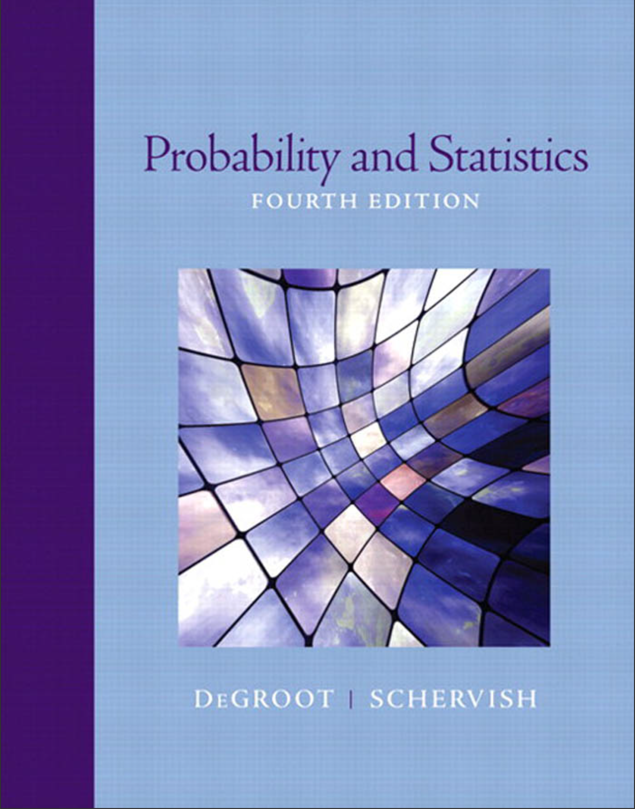

# Introduction to Mathematical Statistics
This is a recreation of the Mathematical Statistics courses I took as an Undergraduate at University of Califonia, Davis from 2009-2013.

## Textbook

## TODO
| Completion | Task |
| ---------- | ---- |
| <li>- [x] </li> | Create Table of Contents |
| <li>- [] </li> | Finish Ch. 1 |
| <li>- [] </li> | Finish Ch. 2 |
| <li>- [] </li> | Finish Ch. 3 |
| <li>- [] </li> | Finish Ch. 4 |
| <li>- [] </li> | Finish Ch. 5 |
| <li>- [] </li> | Finish Ch. 6 |
| <li>- [] </li> | Finish Ch. 7 |
| <li>- [] </li> | Finish Ch. 8 |

